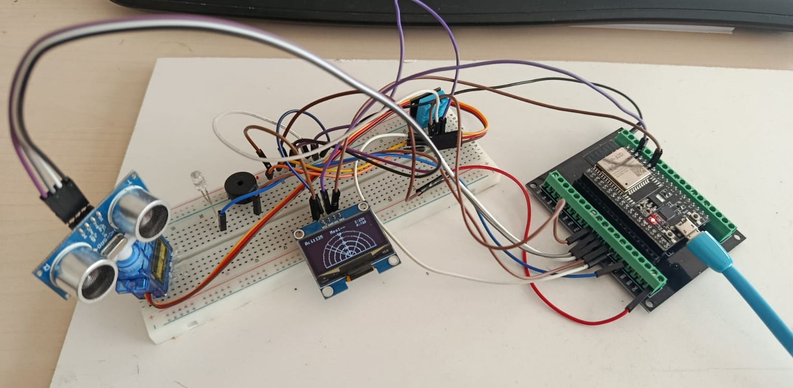

# TA2CAY Radar Projesi

ESP32, HC-SR04 Ultrasonik Sensör, Servo Motor ve SH1106 OLED ekran kullanan gelişmiş radar sistemi.



## Özellikler

- **Görsel Efektler**
  - Tarama izi (fade trail) efekti
  - Engel geçmişi takibi (10 saniye hafıza)
  - Animasyonlu tehlike sembolleri (!, !!, !!!)
  
- **Anlık Veriler**
  - Mesafe ölçümü (0-50 cm)
  - Tarama açısı (0-180°)
  - Ortam sıcaklığı (DHT11)
  - Tespit sayacı ve tarama istatistikleri

## Donanım Gereksinimleri

| Bileşen | Model | Adet |
|---------|-------|------|
| Geliştirme Kartı | ESP32 DevKit | 1 |
| Ekran | SH1106 OLED 1.3" (I2C) | 1 |
| Mesafe Sensörü | HC-SR04 | 1 |
| Servo Motor | SG90 (veya eşdeğeri) | 1 |
| Sıcaklık Sensörü | DHT11 | 1 |
| LED | Standart 5mm | 1 |
| Buzzer | Pasif Buzzer | 1 |

## Pin Bağlantıları

```
ESP32 Pin  →  Bileşen
─────────────────────
GPIO 12    →  Servo Motor (Sinyal)
GPIO 27    →  HC-SR04 (Trig)
GPIO 26    →  HC-SR04 (Echo)
GPIO 25    →  DHT11 (Data)
GPIO 14    →  Buzzer
GPIO 13    →  LED
SDA/SCL    →  OLED Ekran (I2C)
```

## Kurulum

### 1. Kütüphaneleri Yükleyin

Arduino IDE → Sketch → Include Library → Manage Libraries

- `U8g2` (OLED ekran)
- `ESP32Servo` (Servo motor kontrolü)
- `DHT sensor library` (Sıcaklık sensörü)

### 2. Kodu Yükleyin

1. `radar.ino` ve `radar_helpers.ino` dosyalarını indirin
2. Arduino IDE ile `radar.ino` dosyasını açın
3. ESP32 kartınızı seçin (Tools → Board → ESP32 Dev Module)
4. Doğru portu seçin
5. Upload butonuna basın

## Kod Yapısı

### `radar.ino` (Ana Dosya)
- Donanım başlatma ve pin tanımlamaları
- Ana döngü (setup ve loop)
- Sensör okuma ve servo kontrolü
- Ekran çizim fonksiyonları

### `radar_helpers.ino` (Yardımcı Fonksiyonlar)
- `addObstacle()` - Engel hafıza yönetimi
- `drawFadeEffect()` - Tarama izi çizimi
- `drawObstacleHistory()` - Geçmiş engelleri görselleştirme
- `getDangerSymbol()` - Tehlike seviyesi belirleme

## Lisans

MIT License - Detaylar için [LICENSE](LICENSE) dosyasına bakın.

## Geliştirici

**TA2CAY** - Eğitim ve hobi amaçlı geliştirilmiştir.
